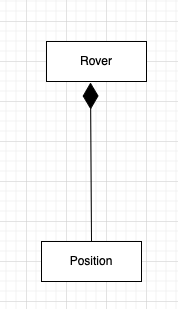

# An attempt to solve Mars Rover Kata

## About

Based on the given [problem statement](https://github.com/boddhisattva/mars_rover/blob/main/problem_statement.md), this is a program that calculates a rovers final position after traversing along a given path within a certain terrain(in this case its a Rectangular plateau). One can see how the sample output looks like from the [program output](https://github.com/boddhisattva/mars_rover/blob/master/README.md#program-output) section


## Code related design decisions

* The entities in the problem domain are - Rover, Position, Rectangular Plateau, Path and Four Cardinal compass directions: North, South, East & West

* A Rover has a Position. This satisfies a "has a" relationship hence I've made use of composition here.



* A Position has properties/attributes like an x cordinate, y coordinate, an orientation/direction which refers to one of the four cardinal compass directions(North, South, East, West) and it can travel within a terrain.

* The code is designed in such a way that a Rover can navigate freely within the perimeter of the specified terrain.
  * In case a Rover attempts to traverse outside the given terrain, they get a `OutsideBoundaryLimitsError` and an appropriate error message

* The code also checks to ensure that a Rover can only traverse along a valid path.
  * In case of an invalid step in the path, an `InvalidStepError` us returned with an appropriate error message

* With Single Responsibility Principle in mind, the responsibility of each class is:
  * A `Rover` class ensures the overall rover movement can happen along a specific path and within a given terrain
  * A `Position` class ensures that an entity makes the movement by one unit in either of the four compass directions - North, South, East, West
  * A `Rectangular Plateau` is the terrain within which actual permissible movement is checked
  * A `Path` class that has a clear representation of valid steps in a given path that a rover can take
  * A separate class each for the four compass directions - `North`, `South`, `East` and `West` with each respective class having a clear way of indicating what movement along that specific direction could look like and what comes to the left & right of each direction

## Areas of Improvement

* The application can be further improved to read input dynamically from a given file and then print the output accordingly. I felt that's a more nice to have currently for the initial version of the app and hence I've not implemented this in the my first working iteration of the Mars Rover Kata.


## Assumptions

* While moving horizontally or vertically, we specifically do not check the current value of orientation from within the `Position` class.
  * For the scope of the given problem statement, since the given compass directions
  determine the movement along the X & Y axis(through the #move method in their respective classes), I currently feel that could be a good start to determine how and when x & y coordinates can be incremented or decremented
  * Since we don't know what the future need of enhancing this application can currently look like, I leaned on the side of applying the YAGNI principle and not checking the orientation for the current position object when incrementing or decrementing the x or y coordinate.

## Usage

### Dependencies
* Ruby 3.2.2
* Please refer to the Gemfile for the other dependencies

### Setup
* Run `bundle install` from a project's root directory to install the related dependencies.
  * A CI/CD setup running automated RSpec tests is also in place for new merge requests made to the current project

### Running the program
One can run the Mars Rover program with the below command from the projects root directory.

`ruby bin/deploy_mars_rover.rb`

### Running the tests
* One can run the specs from the project's root directory with the command `rspec`

### Program Output

* Below is a sample program output run against the command `ruby bin/deploy_mars_rover.rb`

```
1 3 N
5 1 E
```


